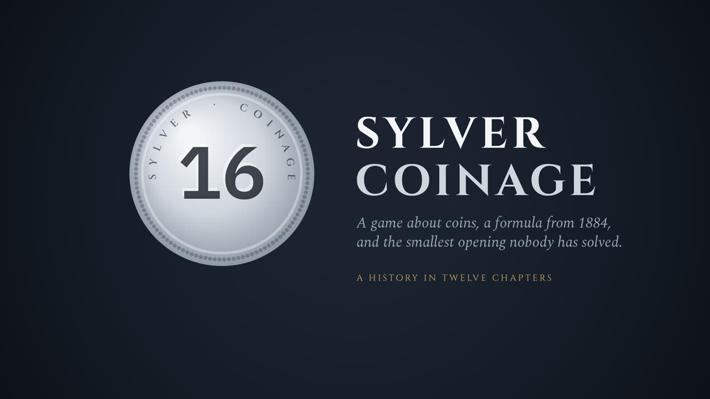

# Sylver Coinage after opening 16 — a machine-verified campaign

**▶ [Live demo](https://rudi-cilibrasi.github.io/sylver-coinage/):**
play Sylver Coinage against the exact solver in your browser, and query
the campaign's 273,000-outcome cache directly from this repository.

[](https://rudi-cilibrasi.github.io/sylver-coinage/story.html)

**▶ [The Sylver Coinage Story](https://rudi-cilibrasi.github.io/sylver-coinage/story.html):**
a six-minute animated history, from Sylvester's coins (1884) through
*Winning Ways*, George Sicherman and Thomas Blok to this campaign
([MP4, 13.6 MB](https://github.com/rudi-cilibrasi/sylver-coinage/releases/download/story-2026-10-10/sylver-coinage-story.mp4)). Then
learn the ideas by playing them in
**[The Sylver Mint](https://rudi-cilibrasi.github.io/sylver-coinage/mint.html)**,
ten small games that end at the reply-38 frontier.

This repository is the complete, auditable record of a computational
campaign on **Sylver Coinage after the opening move 16** (Conway's prize
question: does 16 have a winning reply, and which?).  Every claim below
is backed by artifacts in this history: two independent solver
implementations that agree on outcomes *and* exact evaluated-state
counts, SHA-256-fingerprinted run records, and a conflict-checked cache
of 267,000+ exact position outcomes whose cumulative solver work
exceeds 10^12 states.

## Headline results

For the week of September 21–27, see the [progress summary](docs/progress/2026-09-28-week.md).

- **Reply 38: four P-positions refute five answers (October 9).**
  - I={16,20,22,24}, B28={16,28,38,40}, B24={16,24,38,44} and
    B56={16,38,56,60} are P. Each is short, and every one of its Quiet End
    obligations is covered:
    - by finite witnesses, replayed natively and in Python, or for B56's
      four largest natively and by a sequential Kunz run;
    - by certified nodes;
    - or by another of these positions.
  - So 24, 28, 40, 44 and 56 do not answer the reply 38. {16,28,38} is N,
    which settles the question the Y record left open.
  - No answer to 38 is known yet. It remains the lowest unanswered reply.
  - I and B24 were already on Sicherman's
    [list of P-positions](https://sicherman.net/sylver/ppos.html) (last
    updated September 28), so these certificates confirm them independently. B28 and
    B56 are not on that list. (Corrected October 10: this entry first called
    all four new.)

  See the [record](sylver/campaigns/r38-2026-10-09/RESULT.md).
- **Every reply to the opening 16 up to 36 now has an answer (October 9).**
  - **The ledger.** A ledger of the answers to the even replies up to 200
    collects the certified table, U, Y, Z and the node T. T answers 34 by
    20.
  - **Finite answers.** A scan added seven finite answers, each replayed
    from empty memos: 36 → 23, 58 → 11, 62 → 37, 86 → 33, 90 → 17,
    140 → 13 and 156 → 21. {16,23,36} closes 36.
  - **The frontier.** The lowest unanswered reply is 38.

  See the [ledger](sylver/campaigns/o16-2026-10-09/RESULT.md).
- **Z={16,30,56} is P, so the reply 30 to the opening 16 loses (October 8).**
  - **The certificate.** All 52 of Z's Quiet End obligations are covered.
    - Move 44 is answered by 40 into a second short P-position,
      Z′={16,30,40,44}, whose 40 obligations the same audit covers. Z′ is on
      Sicherman's [list of P-positions](https://sicherman.net/sylver/ppos.html),
      so this confirms it independently (corrected October 10: this entry
      first called it new).
    - The finite witnesses are replayed by `native_solver` and the Python
      evaluator with equal state counts: 896,749,503 states.
    - The two largest, at 297 and 262 million states, are too large for
      Python on this host. They are replayed by `native_solver` and a
      sequential Kunz run instead, with equal counts.
  - **Opening 16.** Every reply to the opening 16 up to 30 now has an
    answer. 32 is not a legal reply (a multiple of 16), and 34 is answered
    by 20, through the certified node T={16,20,34}, so the lowest
    unanswered reply is 36. Opening 16 remains unresolved.
  - **What it rests on.** The Quiet End Theorem, Blok's pairing family, and,
    through the nodes O and K, Sicherman's {8,10,22}.

  See the [Z record](sylver/campaigns/z-2026-10-08/RESULT.md) and the
  [Z obligation table](https://rudi-cilibrasi.github.io/sylver-coinage/z.html).
- **Y={16,28,58} is P, so the reply 28 to the opening 16 loses (October 7).**
  - **The certificate.** Y is short: its half {8,14,29} is a quiet ender.
    All 54 of its Quiet End obligations are covered. Six reach certified
    P-positions (C, E, F, P0). The other 48 have finite witnesses, each
    replayed from empty memos by `native_solver` and the Python evaluator
    with equal state counts, **711,534,629 states** in all; the
    Kunz-coordinate engine's sequential counts match them too.
  - **The search.** A search of 28's even replies found Y. It also indicates
    {16,28,50} P, recorded as unverified discovery output.
  - **Opening 16.** Every reply to the opening 16 up to 28 now has an answer;
    the lowest unanswered reply is 30. Opening 16 remains unresolved.
  - **What it rests on.** The Quiet End Theorem and, through E, F and P0,
    Blok's pairing family; Y does not use Sicherman's {8,10,22}.

  See the [Y record](sylver/campaigns/y-2026-10-07/RESULT.md) and the
  [Y obligation table](https://rudi-cilibrasi.github.io/sylver-coinage/y.html).
- **X={16,26,82,88} is N, so U={16,26,88} is P and the reply 26 to the
  opening 16 loses (October 6).**
  - **X+701.** X's odd reply **701** reaches `{16,26,82,88,701}`, a
    P-position with Frobenius number 819. Two engines with independent move
    code replayed it sequentially. They agree on exactly **633,734,956
    states**, and each certifies its whole memo. These take the place of the
    usual `native_solver` and Python replays, whose memos would not fit this
    62 GB host.
  - **X's least winning odd reply.** Every smaller odd reply of X is N.
  - **U is P.** That covers U's last open obligation, so 88 answers 26. As
    before, U's coverage rests on the Quiet End Theorem and three published
    P-positions.
  - **Opening 16.** With the certified answers to the even replies 2–24,
    every reply to the opening 16 up to 26 is now answered. Opening 16
    remains unresolved; the lowest unanswered reply is 28.
  - **The engine.** The new Kunz-coordinate engine (`sylver/kunz_solver.cpp`,
    PR #35) carried the sweep past this host's memory limit; its memo slots
    take 17 bytes.

  See the [X record](sylver/campaigns/x-2026-10-06/RESULT.md) and the
  [U obligation table](https://rudi-cilibrasi.github.io/sylver-coinage/u.html).
- **U={16,26,88} is P if and only if X={16,26,82,88} is N (September 27):**
  every one of U's 59 Quiet End obligations except the move to X is now
  certified: 52 by Book certificates replayed by the fixed verifier (U's odd
  moves, the July audit's odd witnesses up to `{16,26,38,88,371}`, the reply
  15 to move 24, and positions U shares with W), move
  70 by a finite witness (261; 200 million states) replayed natively and in
  Python, four through the certified nodes G, F and V, and move 98 through
  W. This makes the September 5 reduction checkable. X is N exactly when
  some odd reply reaches a P-position; verified shared-memo sweeps extend
  X's refuted odd replies from 407 to **687**, with none P. See the
  [result](sylver/campaigns/u-2026-09-27/RESULT.md) and the [obligation
  table](https://rudi-cilibrasi.github.io/sylver-coinage/u.html).
- **W={16,26,62,98} is P (September 27):** W's last open move, 108, is
  answered by **213**: `{16,26,62,98,108,213}` is P, and fresh native and
  Python replays agree on exactly **156,823,029 states**. All **52** of W's
  Quiet End obligations are now covered, so **W is P** and hence
  **Q={16,26,88,98} is N** (Q+62 = W); U={16,26,88} P now needs only
  X={16,26,82,88} N. New finite witnesses also answer W's moves 72 (by
  107), 56 (by 97) and 66 (by 263), so W no longer depends on Sicherman's
  published `{16,26,62,72,82}`; through moves 12 and 36 it still rests on
  three published P-positions that the repository's certificates assume
  (`{8,10,12,14}`, `{8,12,26,30}`, `{8,10,22}`). The searches used the new
  parallel engine's shared-memo sweeps. See the
  [result](sylver/campaigns/w-p-2026-09-27/RESULT.md) and the
  [obligation table](https://rudi-cilibrasi.github.io/sylver-coinage/w.html).
- **The Book of W (September 27):** 50 of W's 52 obligations have
  self-contained certificates in [The Book](sylver/arena/book/W.md), each
  replayed by the fixed verifier with a fresh memo and no inherited cache;
  for the large finite witnesses the replay counts equal the campaigns'
  native and Python counts. Searching for finite witnesses removed the
  dependence of W's moves 8, 10, 14, 20, 24, 56, 66, and 72 on
  theorem-backed or published positions (for example, 8 is answered by 49
  and 20 by 14, reaching the Quiet End node `{14,16,20,26}`); moves 12 and
  36 still rest on theorem-backed positions.
- **W frontier reduced to one move (September 27):** after move 118 from
  `W={16,26,62,98}`, reply **167** reaches the finite P-position
  `{16,26,62,98,118,167}`. Fresh native and Python replays agree on P and on
  exactly **115,933,058 states**. W now has **51 of 52 obligations
  covered**; only **108** remains. See the
  [result and reproducible certificate](sylver/campaigns/w-one-2026-09-27/RESULT.md).
- **W frontier reduced to two moves (September 27):** after move 70 from
  `W={16,26,62,98}`, reply **169** reaches the finite P-position
  `{16,26,62,70,98,169}`. Fresh native and Python replays agree on P and on
  exactly **79,594,540 states**. W now has **50 of 52 obligations
  covered**, with **108,118** remaining. See the
  [result and reproducible certificate](sylver/campaigns/w-two-2026-09-27/RESULT.md).
- **W frontier reduced to three moves (September 27):** after move 86 from
  `W={16,26,62,98}`, reply **129** reaches the finite P-position
  `{16,26,62,86,98,129}`; after move 92, reply **139** reaches
  `{16,26,62,92,98,139}`. Fresh native and Python replays agree on P and
  on exactly **68,758,240** and **80,500,948 states**. W now has **49 of
  52 obligations covered**, with **70,108,118** remaining. See the
  [result and reproducible certificates](sylver/campaigns/w-three-2026-09-27/RESULT.md).
- **W frontier reduced to five moves:** after move 102 from
  `W={16,26,62,98}`, reply **95** reaches the finite P-position
  `{16,26,62,95,98,102}`. Fresh native and Python replays agree on P,
  Frobenius number 203, and exactly **44,985,582 states**. W now has
  **47 of 52 obligations covered**, with **70,86,92,108,118** remaining.
  See the [result and reproducible certificate](sylver/campaigns/w-six-2026-09-22/RESULT.md).
- **Earlier W continuation (September 22):** after move 134 from
  `W={16,26,62,98}`, reply **85** reaches the finite P-position
  `{16,26,62,85,98,134}`. Independent native and Python replays agree on
  the P outcome and exact count of 37,192,385 states, without inherited
  outcome assumptions. This left six
  W moves unresolved before the move-102 result above. See the
  [September 22 continuation and reproducible certificate](sylver/campaigns/w-seven-2026-09-22/RESULT.md).
- **September 22 certificate:** `{16,26,56,62,66}` is P, with all 40
  obligations covered. The last move, 76, is answered by 247. A fresh
  replay checks all 69 finite leaves without the campaign cache; six
  established infinite certificates remain explicit dependencies. This
  answers move 66 from `W={16,26,62,98}` with 56 and left seven W moves
  unresolved before the continuation above. See the [result, response table, and reproduction command](sylver/campaigns/targeted-2026-09-22/RESULT.md).
- **September 5 verification release:** independent confirmation of the
  published P-position `{16,26,54,60,62}`, with all 38 root obligations
  covered. The [report and reproducibility bundle](sylver/publication/plan2-2026-09-05/README.md)
  include a fresh public reconstruction, 62 recomputed finite leaves,
  41 matching Python cross-checks, and 27 passing tests. The certificate
  names its three published P-position dependencies explicitly.
  [Download the archive](sylver/publication/plan2-2026-09-05.tar.gz)
  ([SHA-256](sylver/publication/plan2-2026-09-05.tar.gz.sha256)).
- **A certified response table answering every even move 2–24 after
  opening 16** (odd moves lose by Hutchings' theorem).  Includes
  independent confirmations of published claims by G. Sicherman and
  T. Blok: `{16,20,34}` (answers move 20), `{10,16,24}` (answers move
  24), the `{8,10,22}` ultimate-periodicity certificate, and a
  machine-checked audit of Blok's `{8,12}` pairing theorem.
- **`{12,16,20}` is an N-position via the even reply 8**
  (`<12,16,20,8> = <8,12>`), completing a step left open in Blok's 2021
  g=2 report.  See `sylver/eight_twelve.py` and `sylver/RESEARCH.md`
  (Attempt 5).
- **Six apparently new P-positions, plus an independent confirmation
  of a seventh**: the certified node `{16,26,36,56}` turns out to
  appear on G. Sicherman's online P-position table (our thanks for the
  correction), making this campaign's full finite certificate for it an
  unwitting independent verification; the other six await priority
  checks against T. Blok's unpublished analyses.  Full certificates in
  `sylver/short_certificates.py` and the `RUN_*.txt` records.
- **The move-26 program, corrected September 5**: `{16,26}` is short;
  thirty of its 42 even children are refuted. Its child
  `U={16,26,88}` is P iff **both** `X={16,26,82,88}` and
  `Q={16,26,88,98}` are N. The previous reduction to X alone was
  unsupported. Every odd reply to X through 407 and **all 32 even
  children of X are proved N** (`sylver/RUN_X_EVEN_FLANK.txt`).
  See the [correction and counterexample](sylver/publication/plan2-2026-09-05/REPORT.md#correction-to-the-opening-16-reduction).
- **The first size measurement of a g=2 periodicity computation of this
  class**: row X+409's dependency closure exceeds 3.15M translated
  shapes and 12.5M base-region exact positions, still unsaturated
  (`sylver/RUN_PERIODICITY_500H.txt`, `sylver/RUN_PERIODICITY_AWS.txt`);
  `{8,10,22}` needs 50 shapes for comparison.

No open problem is claimed solved: `X`, `Q`, move 26, and the opening remain
undecided.  See `sylver/RESEARCH.md` for the complete attempt-by-attempt
log, including negative results and two soundness bugs found and fixed
by the audit discipline.

## Verifying

```sh
python -m unittest discover -s tests          # full suite
python -m sylver.solver 16 6                  # exact finite evaluator
g++ -std=c++20 -O2 -Wall -Wextra -pedantic -pthread \
    sylver/periodicity_engine.cpp -o engine
./engine /tmp/ctl.cache 201 8 10 22           # reproduces the published
                                              # PERIOD start=49 length=8
```

The deep-certificate suite recomputes every claimed P-position; state
counts are deterministic and must match the run records exactly.

## Arenas

Run a local tournament with frozen fixtures, independently checked proof
certificates, and CPU-based scores:

```sh
python -m sylver.arena pilot --output /tmp/arena-pilot
```

The pilot compares three baseline policies and evolved prompt/policy variants,
using an offline scripted agent. It reports failures, repeated measurements,
and held-out results separately. See the [arena instructions](sylver/arena/README.md)
and [recorded pilot](sylver/arena/data/pilot/REPORT.md). This is an engineering
experiment; no new live discovery or real-LLM performance advantage is claimed.

**Certificate golf and The Book.** Programs also compete to *certify* results
the database already knows with the shortest, cheapest-to-check proofs. The
frozen 308,322-fact database is an untrusted, hash-pinned hint oracle; every
certificate is replayed by the fixed verifier. In the
[golf pilot](sylver/arena/data/golf/REPORT.md) every hinted strategy certified
all 16 panel targets; the hint-free control needed 1.5–2.6 times the CPU on
finite targets and certified neither gcd-two W target. Where the database
offered a much cheaper witness, the witness certificate scored up to 2.8
times better than the verifier's own root search.
[The Book](sylver/arena/book/BOOK.md) keeps the cheapest-to-check certificate
for each target, re-verified three times with deterministic state counts.

```sh
python -m sylver.arena golf-pilot --output /tmp/golf-pilot --workers 3
python -m sylver.arena book verify
```

Programs can also play the game itself. `python -m sylver.arena league --output
/tmp/league-pilot` runs a round robin of player programs (built-in `random`,
`smallest`, `exact`, and `book` players, or external executables speaking a
JSON Lines protocol) under CPU clocks, and reports Bradley–Terry ratings, loss
reasons, and how often the perfect-play winner won openings of known outcome.
Game results are not proofs. See the [game arena instructions](sylver/arena/README.md#game-arena)
and the [recorded pilot league](sylver/arena/data/league/REPORT.md).

## Repository map

| Path | Contents |
| --- | --- |
| `sylver/arena/` | frozen challenges, canonical proof referee, accounted episodes, policy evolution, CLI tournaments, certificate golf and The Book (`book/`), and game-playing leagues |
| `sylver/solver.py` | exact finite evaluator (Python reference) |
| `sylver/native_solver.cpp` | the same recurrence in C++ (differentially tested) |
| `sylver/fast_solver.cpp` | discovery engine: the native recurrence with a flat memo, 1.7–1.9x faster, byte-identical output (differentially tested) |
| `sylver/parallel_solver.cpp` | parallel discovery engine: the same recurrence searched by `--threads` threads sharing one sharded memo keyed by the root's gap bits; exact outcomes (any winning move; state counts vary), about 5x faster at 6 threads and 30–45% smaller; `--odd-range`/`--odd-list` sweeps share one memo across candidates; `--verify-memo` checks the finished memo as a certificate; sequential output with `--threads 1` (differentially tested; build with `-march=native` for BMI2) |
| `sylver/kunz_solver.cpp` | Kunz-coordinate discovery engine: the parallel engine's recurrence, threads, sweeps and `--verify-memo`, with each state held as its Kunz coordinates (its gap count in each residue class modulo the root's smallest generator, which must be at most 16) in one 16-byte vector instead of a bitset; moves are byte-vector min-plus updates; a memo slot takes 17 bytes (about 24 per state), against 66 for the 8-word gap keys of X's sweeps near reply 683; `--verify-memo` also checks that every key is a semigroup containing the root; sweeps can end at a row boundary (`--max-states`, `--stop-file`) and still verify; sequential output with `--threads 1` (differentially tested; build with `-march=native`) |
| `sylver/periodicity_engine.cpp` | g=2 ultimate-periodicity engine: checkpointed, parallel exact fallbacks, compact v2 representation |
| `sylver/short_certificates.py` | the certified P-node graph and opening-16 table |
| `sylver/publication/plan2-2026-09-05/` | verification report, public certificate, source snapshot, and reproduction instructions |
| `sylver/campaigns/` | September 22 certificates, bounded experiments, verification receipts, and remaining obligations |
| `sylver/RESEARCH.md` | the full research log (Attempts 1–23) |
| `sylver/RUN_*.txt` | fingerprinted run records for every campaign |
| `sylver/move26_data/` | exact outcome cache (267,847 rows) and scan artifacts |
| `tests/` | 60+ unit and differential tests |
| `docs/superpowers/` | design specs and implementation plans for each campaign |
| `docs/story.*`, `docs/mint.*` | the history film (`render-story.mjs` renders it to MP4) and the Mint's ten lessons; `tests/test_docs_story.py` and `tests/test_docs_mint.py` check their facts against the audits |

## Large artifacts

This public history is filtered from a larger private research
repository: only Sylver Coinage material is included, and one file —
the 505 MB version-1 periodicity row checkpoint — is distributed as a
release asset rather than a git blob (its SHA-256,
`cd2a912587395e221d4956236db365f74a2c474d855c2d28d0e45551008a1c28`, is
pinned in the run records).  Source-file SHA-256 fingerprints cited in
`RUN_*.txt` records are content hashes and remain verifiable in this
history.

## Author

Rudi Cilibrasi (<rudi@metagood.com>), with campaign engineering by
Claude (Anthropic) and GPT 5.6 Sol (OpenAI).  AI subscriptions
generously provided by [Metagood.com](https://metagood.com).
Independent confirmation or refutation of any result is warmly
invited.
